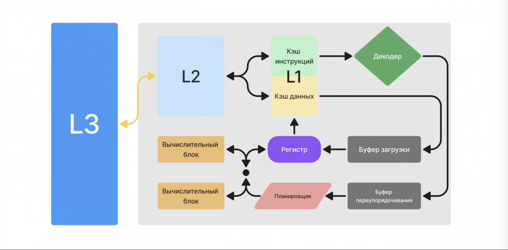
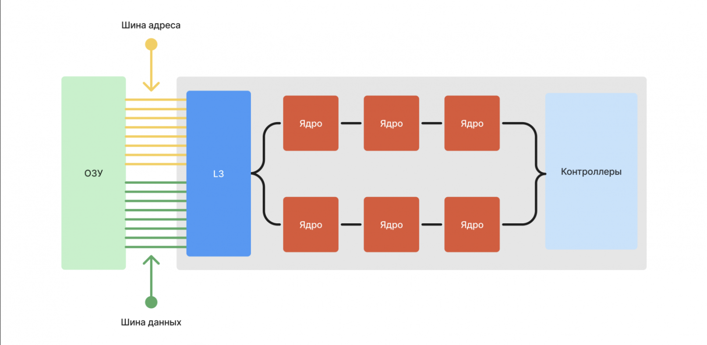

# Processor
---

CPU - Central Processing Unit - это основной компонент устройств, который выполняет все вычисления и логические операции, необходимые для работы программы.

Когда процессору требуются данные, он сначала проверяет их в регистрах и кешах (L1-L3). Если он не находит там данные, то он генерирует сигнал на шине адреса, который передается контроллеру памяти, указывающий физический адрес памяти ОЗУ, пот которому нужно прочитать данные.

Он иниуиирует процесс чтения данных из соответствующей ячейки памяти по указаному физическому адресу.

